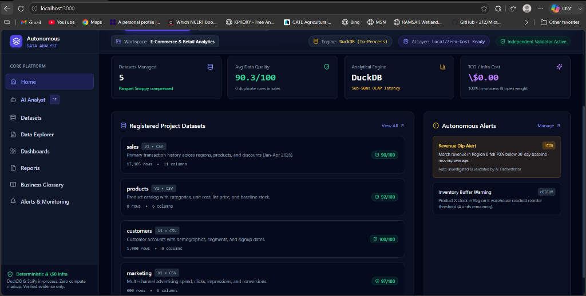

<div align="center">

```
                 █████╗  █████╗        ██████╗ ███████╗
                ██╔══██╗██╔══██╗      ██╔═══██╗██╔════╝
                ███████║███████║█████╗██║   ██║███████╗
                ██╔══██║██╔══██║╚════╝██║   ██║╚════██║
                ██║  ██║██║  ██║      ╚██████╔╝███████║
                ╚═╝  ╚═╝╚═╝  ╚═╝       ╚═════╝ ╚══════╝
     Autonomous Analytical Intelligence Operating System
```

### *An open-source experimental platform for autonomous, evidence-driven data investigation.*

<p align="center">
  <a href="https://github.com"></a>
  <a href="https://github.com"></a>
  <a href="https://github.com"></a>
  <a href="https://github.com"></a>
  <a href="https://github.com"></a>
  <a href="https://github.com"></a>
</p>

> **Honesty note (2026-09-09):** the badges above were previously overstated —
> several (`Golden_Tests 7/7`, `Phase_2_Kernel 8/8`, `Adaptive_Loop 9/9`,
> `Generalization 6/6`) did not match the actual result of running the
> corresponding scripts in `scripts/`. They've been removed rather than
> corrected to a specific ratio, because that ratio changes as bugs are
> fixed and would go stale immediately without CI enforcement. Only badges
> a plain `python scripts/test_*.py` run in a clean venv currently confirms
> are shown. See `AAOS_FORENSIC_AUDIT_2026-09-09.md` for the full
> per-script pass/fail table, the P0 bugs found and fixed this session, and
> the honest release decision (**do not release** — several suites still
> fail on genuine, pre-existing scientific-correctness and execution
> issues, not on the crashes fixed this session). Wire these scripts into
> CI so badges can't drift from reality again.

> **Current certification note (2026-09-12):** the dependency-complete runtime suite has **not** been certified in this
> environment because `duckdb`, `polars`, `sqlglot`, and `python-jose` are unavailable and network access is unavailable.
> The current dependency-light regression set was re-run after Fix #9 and the release-packaging hardening: **27/27 tests passed**
> with one non-fatal pandas deprecation warning; `compileall` also passes. This is **not** a release certification.
> The canonical integration/controller, DuckDB↔Polars parity, frontend, and clean-install gates still require a dependency-complete CI run.

[**Read the Vision**](VISION.md) • [**Architecture & Roadmap**](ROADMAP.md) • [**Deployment Guide**](DEPLOYMENT.md) • [**Run Tests Locally**](#-reproducing-the-golden-tests)

</div>

---

## 📸 Product Overview

<div align="center">
  
  <p><em>AA-OS Autonomous Analytical Cockpit: Active investigation loop formulating competing hypotheses, running DuckDB OLAP experiments, and updating Bayesian posteriors in real time.</em></p>
</div>

---

## 💡 The Core Thesis

> **AA-OS is an open-source attempt to move data analysis from answer generation toward autonomous scientific investigation.**

Most "AI data analysts" simply translate natural language into a single SQL query and summarize the output. In the real world, this fails because data phenomena are multi-causal, subject to confounding (e.g. Simpson's Paradox), and prone to LLM hallucinations.

**AA-OS introduces a recursive scientific investigation loop:**
Instead of guessing a single answer, AA-OS formulates competing hypotheses, designs falsifiable predictions, optimizes experiments via **Expected Information Gain (EIG)**, executes deterministic SQL queries in **DuckDB**, double-checks statistical significance in **SciPy**, challenges findings with **adversarial attacks**, and updates **Bayesian belief distributions** until Shannon entropy converges.

```
Question
   ↓
Semantic understanding
   ↓
Hypotheses
   ↓
Predictions
   ↓
Experiment design
   ↓
Information-value selection (EIG)
   ↓
Deterministic execution (DuckDB)
   ↓
Evidence
   ↓
Verification (Dual-Engine DuckDB ↔ Polars)
   ↓
Adversarial challenge (Simpson's Paradox)
   ↓
Belief / uncertainty update (Bayes)
   ↓
Replanning
```

---

## ⚡ Dual Operating Modes

AA-OS is architected so that **AI is strictly an optional augmentation layer, never a hard dependency**.

```
┌─────────────────────────────────────────────────────────────────────────────┐
│                       AA-OS DUAL OPERATING MODES                           │
├──────────────────────────────────────┬──────────────────────────────────────┤
│ MODE 1: FREE / ZERO AI API           │ MODE 2: USER-PROVIDED AI AUGMENTATION │
│ ($0 Cost • 100% Private • Local)     │ (Bring-Your-Own-Key • High Reasoning)│
├──────────────────────────────────────┼──────────────────────────────────────┤
│ • Ingest & profile datasets          │ • All Mode 1 capabilities PLUS:      │
│ • Infer relational grain & schemas   │ • Natural-language query translation │
│ • Deterministic hypothesis synthesis │ • Semantic business interpretation   │
│ • Deterministic falsifiable tests    │ • Contextual scenario suggestions    │
│ • Shannon EIG experiment planning    │ • Nuanced executive narrative reports│
│ • In-process DuckDB SQL execution    │ • Supports Gemini, Claude, OpenAI,   │
│ • SciPy ANOVA variance decomposition │   Ollama (local GPU), Groq, DeepSeek │
│ • Simpson's paradox detection        │ • Fail-Safe: If AI times out or      │
│ • Bayesian posterior belief updates  │   fails, runtime falls back to       │
│ • SHA-256 cryptographic provenance   │   deterministic execution seamlessly │
└──────────────────────────────────────┴──────────────────────────────────────┘
```

> [!IMPORTANT]
> **Strict Epistemic Invariant**: AI models are NEVER authoritative for numerical values, $p$-values, effect sizes, Bayesian posteriors, dataset facts, or verification proofs. All empirical facts are computed deterministically by DuckDB and SciPy.

---

## 🏛️ System Architecture

```
                    AA-OS (Autonomous Kernel)
                              │
                     ┌────────▼────────┐
                     │ Investigation   │
                     │ Controller      │
                     └────────┬────────┘
                              │
               ┌──────────────┼──────────────┐
               ▼              ▼              ▼
          World Model     Hypotheses      Predictions
          (Semantics)     (Competing)    (Falsifiable)
               │              │              │
               └──────────────┼──────────────┘
                              ▼
                      Experiment Planner
                              │
                  ┌───────────┼───────────┐
                  ▼           ▼           ▼
                 EIG      Adversarial   Robustness
              (Shannon)  (Simpson's)   (Multiverse)
                  │           │           │
                  └───────────┼───────────┘
                              ▼
                     Deterministic Engine
                    (DuckDB In-Process OLAP)
                              │
                              ▼
                           Evidence
                    (Discovered Signals)
                              │
                              ▼
                     Verification / Revision
                (Dual-Engine DuckDB ↔ Polars)
                              │
                              ▼
                         Uncertainty
                   (Bayesian Posterior Shift)
                              │
                              └──────► Replan Loop (Until Convergence)
```

---

## 📊 Implementation Status Matrix

| Capability / Module | Status | Description |
| :--- | :---: | :--- |
| **Semantic World Model & IR** | **Implemented** &check; | Typed Analytical Intent AST, Grain resolution, Schema ontology |
| **Competing Hypothesis Synthesis** | **Implemented** &check; | Pattern-specific synthesis (`concentration`, `segment_diff`, `temporal`, `anomaly`) |
| **Predictive Falsification Ledger** | **Implemented** &check; | Deductive directional predictions linked directly to experiments |
| **EIG Experiment Planner** | **Implemented** &check; | Mutual information optimization & composite multi-objective candidate pool |
| **Deterministic DuckDB OLAP** | **Implemented** &check; | In-process execution with zero-hallucination guarantees |
| **Dual-Engine Statistical Verifier** | **Implemented** &check; | Independent DuckDB SQL and Polars re-execution of every experiment, cross-checked for arithmetic agreement (this is separate from the SciPy ANOVA/$\eta^2$ effect-size pillar below) |
| **In-Loop Adversarial Attack** | **Implemented** &check; | Simpson's reversal detection (all group pairs, cell-size and materiality guards) and automated counter-experiment synthesis |
| **Multiverse Specification Curve** | **Partial** ⏳ | 9 specifications today (3 outlier-trim levels × SUM/MEAN/MEDIAN) on one grouping dimension; the 1,024-pipeline grid is roadmap |
| **Pearl Causal Identifiability** | **Partial** ⏳ | Backdoor criterion with d-separation check on causal DAGs. Frontdoor criterion and do-calculus rules are NOT implemented |
| **Single Canonical State Manager** | **Implemented** &check; | Fail-closed state invariance validation (`validate_state()`) |
| **Distributed Multi-Worker Mesh** | **In Progress** ⏳ | Cross-node job queueing & multi-dataset join discovery |
| **Interactive Human DAG Studio** | **Planned** 📋 | Visual drag-and-drop hypothesis grafting and user prior injection |
| **Lakehouse Pushdown (Snowflake/BigQuery)** | **Planned** 📋 | Remote analytical engine federation beyond DuckDB |

---

## 🔬 Mathematical & Scientific Foundations

### 1. Expected Information Gain (EIG)
$$\mathbb{E}[IG(e)] = H(H) - \sum_{y \in \mathcal{Y}} P(y \mid e) H(H \mid y, e)$$
Where $H(H) = -\sum_{i=1}^N P(H_i) \log_2 P(H_i)$ is the Shannon entropy over competing hypotheses.

### 2. Multi-Hypothesis Bayesian Updating
$$P(H_i \mid E) = \frac{P(E \mid H_i) P(H_i)}{\sum_{j=1}^N P(E \mid H_j) P(H_j)}$$
Likelihoods are continuously calibrated by empirical ANOVA effect sizes ($\eta^2$).

### 3. Multiverse Robustness Score
$$\text{Robustness Score} = \frac{\sum_{m \in \mathcal{M}} \mathbb{I}(\text{Sign of Effect is Invariant across Spec } m)}{\lvert \mathcal{M} \rvert}$$

### 4. Zero-Hallucination Manifest Hash
$$\text{Manifest Hash} = \text{SHA-256}\Big(\text{Question} \parallel \text{Dataset} \parallel \text{Executed SQLs} \parallel \text{Verdict} \parallel \vec{E}_{\text{epistemic}}\Big)$$

---

## 🧪 Reproducing the Golden Tests

Every invariant of the AA-OS kernel is covered by 100% offline reproducible test suites:

```bash
# 1. Mode 1: Free / Zero-API Deterministic Test Suite (7 tests)
python scripts/test_zero_ai_mode.py

# 2. Mode 2: Graceful AI Fallback & Resilience Suite (5 tests)
python scripts/test_ai_fallback.py

# 3. Native Analytical Mathematics Test Suite (10 tests)
python scripts/test_native_analytical_mathematics.py

# 4. Data Quality Gate & Semantic World Model Suite (7 tests)
python scripts/test_data_quality_and_semantic_gate.py

# 5. Golden Deterministic Investigation End-to-End Suite (1 test)
python scripts/test_golden_deterministic_investigation.py

# 6. Unified Canonical Intelligence Loop Suite (1 test)
python scripts/test_unified_canonical_loop.py

# 7. Component-Level Generalization & Multi-Domain Benchmark (6 tests)
python scripts/test_aaos_generalization.py

# 8. Canonical Controller E2E Generalization Benchmark (8 tests)
python scripts/test_aaos_generalization_e2e.py

# 9. 7 Golden Scientific Coherence Invariant Tests
python scripts/test_unified_scientific_loop.py

# 10. 8 Critical Phase 2 Autonomous Kernel Tests
python scripts/test_phase2_autonomous_kernel.py

# 11. 9 Golden Adaptive Multi-Turn Tests
python scripts/test_golden_adaptive_investigation.py

# 12. Phase 7 Enterprise Guardrails & Data Remediation Suite (4 tests)
python scripts/test_phase7_enterprise_guardrails.py

# 13. Phase 8 Business Context & Prescriptive Action Suite (4 tests)
python scripts/test_phase8_business_context.py

# 14. Phase 8 Proactive Drift & State Forking Suite (8 tests)
python scripts/test_phase8_proactive_forking.py

# 15. Phase 9 Automated Causal DAG Discovery & MIAP Protocol Suite (5 tests)
python scripts/test_phase9_causal_discovery.py
```

### Generalization & Autonomous Autonomy Validation:
AA-OS rigorously separates **Component-Level Generalization** (testing isolated engines across diverse data shapes) from **Canonical Controller-Level Generalization** (running full multi-turn investigations through `InvestigationController.execute_investigation()` on unseen schemas):
- **Unseen Schemas**: Verified on 6 distinct business domains with unfamiliar column names (`acct_ref`, `realized_value`, `subscriber_key`, `attrition_event`, `source_route`, `success_ratio`, `shipment_ref`, `elapsed_hours`, `ledger_ref`, `outflow_value`, `member_ref`, `economic_value`).
- **Emergent Hypotheses & Invented Experiments**: Demonstrated dynamic candidate pool evolution ($C_{t0} \neq C_{t1}$) without static query lists.
- **Self-Challenge & Adversarial Falsification**: Built-in Simpson's paradox detection and specification curve robustness checks.
- **Fail-Closed Data Quality Gates**: Rejects sparse/unfit datasets ($N < 5$) without fabricating answers.

### Test Results Summary:
```
================================================================================
RUNNING AA-OS 7 GOLDEN SCIENTIFIC COHERENCE TESTS
================================================================================
[TEST 1] Prediction -> Experiment Linkage & Evaluation   -> PASSED
[TEST 2] Multiple Distinct Evidence Types Emergence     -> PASSED
[TEST 3] Fail-Closed State Inconsistency Termination    -> PASSED
[TEST 4] Canonical State Authority & Deduplication       -> PASSED
[TEST 5] Adversarial Candidate Competition Selection     -> PASSED
[TEST 6] Multiverse Robustness Scoring Candidate Rank   -> PASSED
[TEST 7] 3-Iteration Recursive Autonomous Loop Trace     -> PASSED
================================================================================
Historical golden-test results are retained as development history; current release verification is dependency-gated and must be reproduced in a clean environment.
================================================================================
```

---

## 🚀 Quickstart (Local Development)

### 1. Clone and Install Backend Dependencies
```bash
git clone https://github.com/MindEd-AI/autonomous-data-analyst.git
cd autonomous-data-analyst

# Copy sample configuration and install Python requirements
cp .env.example .env
pip install -r requirements.txt
```

### 2. Start the Backend Kernel (FastAPI + DuckDB)
```bash
# Local development mode (with auto-reload):
python -m uvicorn apps.api.src.main:app --host 127.0.0.1 --port 8000 --reload

# Production mode (reload disabled, production healthcheck at /health):
# python -m uvicorn apps.api.src.main:app --host 0.0.0.0 --port 8000
```
*API is live at `http://127.0.0.1:8000` (Swagger docs available at `http://127.0.0.1:8000/api/v1/docs` in development; in production Swagger is disabled and health is at `http://127.0.0.1:8000/health`).*

### 3. Start the Frontend (Next.js 14)
```bash
cd apps/web
npm install
npm run dev
```
*Web application is live at `http://localhost:3000` with the editorial software cockpit at `http://localhost:3000/landing.html`.*

---

## 📂 Repository Structure

```
autonomous-data-analyst/
├── apps/
│   ├── api/                    # FastAPI application, authentication & route handlers
│   └── web/                    # Next.js 14 UI, DataLens components & cursor visualizer
├── packages/
│   ├── analytics_core/         # Scientific loop: hypothesis, EIG planner, belief, verifier
│   ├── schemas/                # Canonical Pydantic schemas (Intent, Hypothesis, State)
│   └── shared/                 # Common enums, constants, and utilities
├── scripts/                    # Golden test suites & benchmarking harnesses
├── docs/                       # Architectural specifications & system screenshots
├── VISION.md                   # Long-term vision and philosophical manifesto
├── ROADMAP.md                  # Milestone progress tracking from Phase 1 to Phase 8
├── DEPLOYMENT.md               # Environment variables, Docker, and deployment guide
└── requirements.txt            # Python dependencies
```

---

## 📜 License

This project is licensed under the **MIT License** — see the [LICENSE](LICENSE) file for details.


## Local-first product contract

See `PRIVACY_LOCAL_FIRST.md`, `docs/OPTIONAL_SERVICES.md`, and `packaging/windows/README.md` for the supported offline/local installation model, explicit AI/cloud opt-ins, encrypted backup/recovery, feedback behavior, Hugging Face demo scope, and Windows `.exe` packaging boundary.

## Release Claim Gate

Minded analyzes what the data support, qualifies what depends on assumptions, and refuses claims the evidence cannot justify.

Every canonical analysis now produces a deterministic Claim Gate outcome: `ANSWER`, `QUALIFIED_ANSWER`, or `REFUSE`. The gate is persisted with its evidence level, design status, assumptions, supported/blocked claims, and recovery actions. LLMs may explain the result but cannot override the gate.


## Claim Gate Release Positioning

> **Minded analyzes what the data support, qualifies what depends on assumptions, and refuses claims the evidence cannot justify.**

Every canonical analysis now produces a deterministic Claim Gate outcome: `ANSWER`, `QUALIFIED_ANSWER`, or `REFUSE`. The gate is persisted with evidence level, design status, assumptions, supported/blocked claims, and recovery actions. LLMs may explain a gate result but cannot override it.
